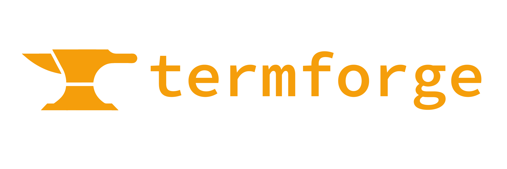

Terminal Forge aims to be the go-to knowledge base for developers building CLI and TUI applications. Our vision is to empower developers with up-to-date resources, best practices, and tools to create great terminal applications. Terminal Forge is committed to remaining a non-profit, open-source initiative, ensuring that knowledge and resources are freely accessible to all developers, now and in the future.

🍿 Stay tuned for more to come! 🍿
